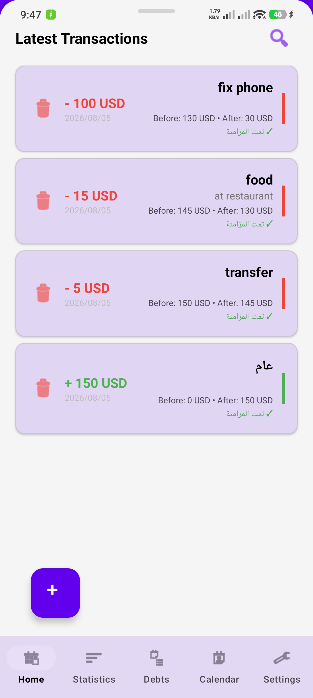
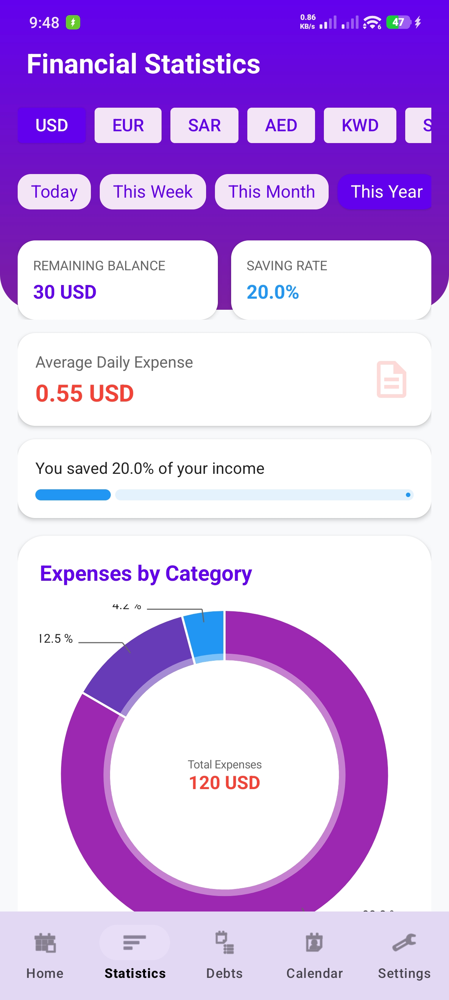
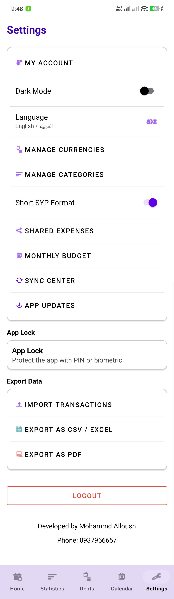

# Masarifi Pro

A personal finance Android application developed primarily in Java.

Masarifi Pro helps users manage income, expenses, balances, and financial transactions across multiple currencies. It supports offline usage, multi-device synchronization, data export, QR sharing, and application updates through GitHub Releases.

## Features

- Income and expense tracking
- Multi-currency support
- Transaction filtering and management
- Balance history before and after transactions
- Payment status tracking
- CSV and PDF export
- QR-based data sharing
- Offline local data storage
- Multi-device synchronization
- Duplicate transaction prevention during synchronization
- Automatic update checking through GitHub Releases
- Arabic and English interface support

  ## Screenshots

  
  

  
  

## Technologies

- Java
- Android SDK
- XML Layouts
- Firebase
- Local data storage
- Gradle
- Git and GitHub

## Download

The latest signed APK is available from GitHub Releases:

[Download the latest Masarifi Pro release](https://github.com/mohammdalloush175-sys/MasarifiPro/releases/latest)

> The application is currently distributed directly as an APK and is not published on Google Play.

## Installation

1. Download the latest APK from the Releases page.
2. Allow installation from unknown sources when prompted by Android.
3. Install the APK.
4. Open the application and complete the initial setup.

## Project Structure

- `app/` — Android application source code
- `functions/` — Backend and synchronization-related functions
- `docs/` — Project documentation
- `scripts/` — Development and release scripts
- `CHANGELOG.md` — Version history and release changes

## Current Status

Masarifi Pro is under active development. New releases, improvements, and bug fixes are published through GitHub Releases.

## Developer

Developed by **Mohammd Aloush**

Junior Android Developer focused on practical mobile applications using Java, Kotlin, Jetpack Compose, Firebase, and Android Studio.
